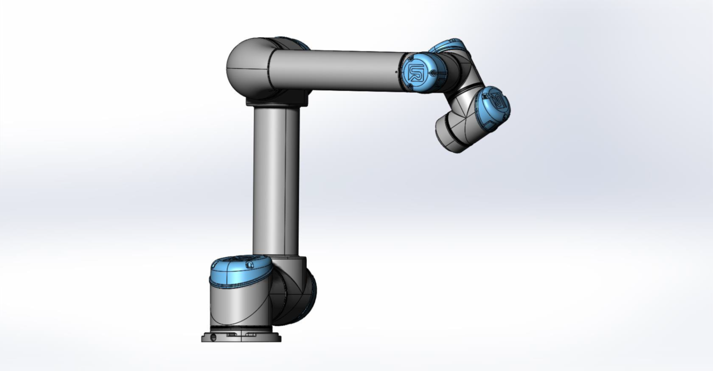

# Mimicking Pick and Place with UR5 Manipulator

This repository contains the implementation for the final project of ENPM662. The project demonstrates a pick-and-place operation using a UR5 robot arm in a simulated environment. This project utilizes ROS (Robot Operating System) for managing the robot's movements and interactions.

| Name                    | GitHub Profile                             |
|-------------------------|--------------------------------------------|
| Saketh Narayan Banagiri | [Sakethbngr](https://github.com/Sakethbngr)|
| Aashrita Chemakura      | [aashrita-chemakura](https://github.com/aashrita-chemakura) |

## Contents

- Part Files and Assembly
- ROS Package for Simulation
- Scripts for Operation
- Video Demonstrations of the Project

## Prerequisites

Before setting up the project, ensure you have ROS installed on your system (preferably ROS Melodic or Noetic, depending on your OS compatibility). Additionally, you need a catkin workspace set up.

## Solidworks Design 
<p align="center">

</p>

## Installation

1. Clone this repository into your catkin workspace's src folder:

```bash
cd ~/catkin_ws/src
git clone https://github.com/aashrita-chemakura/Mimicking-pick-and-place-UR5-manipulator.git
```

## Contents
- Part Files and Assembly
- ROS Package for Simulation
- Scripts for Operation
- Video Demonstrations of the Project
## Prerequisites

Before setting up the project, ensure you have ROS installed on your system (preferably ROS Melodic or Noetic, depending on your OS compatibility). Additionally, you need a catkin workspace set up.

## Installation

1. Clone this repository into your catkin workspace's src folder:

```bash
cd ~/catkin_ws/src
git clone https://github.com/aashrita-chemakura/Mimicking-pick-and-place-UR5-manipulator.git
```
2. Download the required ROS package ('ur5v9') from the specified ROS package folder and add it to the src directory of your catkin workspace.
3. Navigate back to your catkin workspace root and build the project:
```bash
cd ~/catkin_ws
catkin_make
source devel/setup.bash
```
## Running the Code
To run the simulation and control the UR5 manipulator, use the following commands. Open separate terminals for each command and run them in the given order:

1. Launch the simulation world:
```bash
roslaunch ur5v9 new_world.launch
```
2. Run the publisher node:
```bash
rosrun ur5v9 pub.py
```
3. Run the subscriber node:
```bash
rosrun ur5v9 sub.py
```
## For Teleoperation
To control the UR5 robot manually:

1. You can either launch the same world as before or a different URDF setup:
```bash
roslaunch ur5v9 ur5_urdf.launch
# or
roslaunch ur5v9 new_world.launch
```
2. Run the teleoperation script:
```bash
rosrun ur5v9 ur5_teleop.py
```
